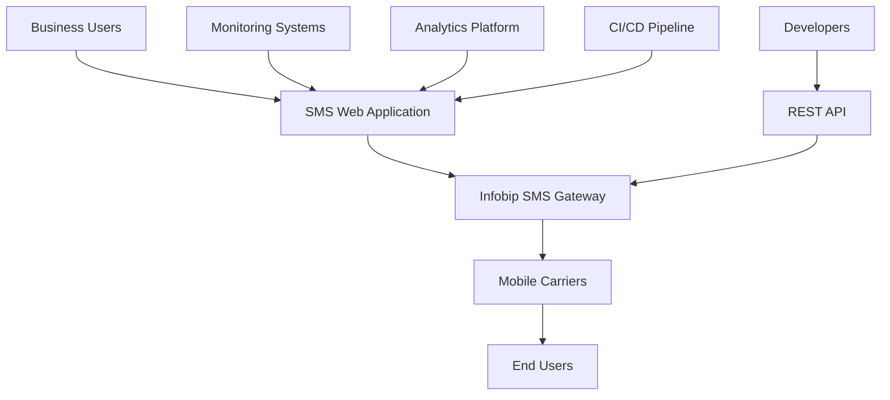
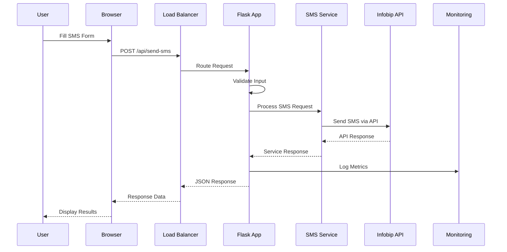
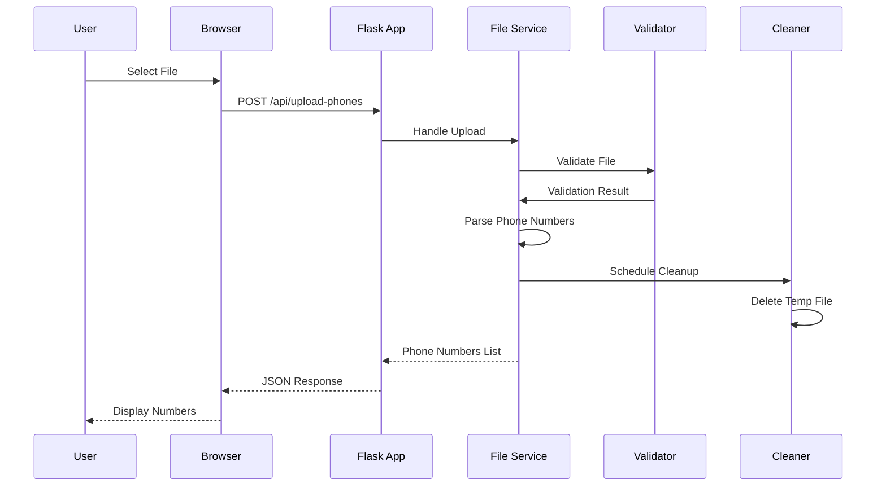
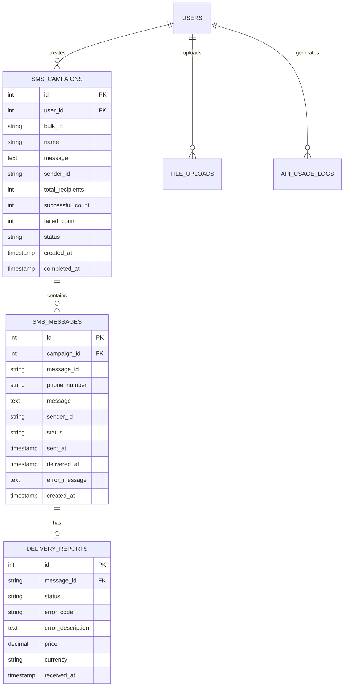

# 🏗️ SMS Web Application Architecture

## 📋 Table of Contents

1. [System Overview](#-system-overview)
2. [High-Level Architecture](#-high-level-architecture)
3. [Component Architecture](#-component-architecture)
4. [Data Flow Architecture](#-data-flow-architecture)
5. [API Architecture](#-api-architecture)
6. [Database Architecture](#-database-architecture)
7. [Security Architecture](#-security-architecture)
8. [Deployment Architecture](#-deployment-architecture)
9. [Monitoring Architecture](#-monitoring-architecture)
10. [Scalability Architecture](#-scalability-architecture)
11. [Integration Architecture](#-integration-architecture)
12. [Technology Stack](#-technology-stack)

---

## 🌐 System Overview

### Purpose
The SMS Web Application is a modern, scalable web-based platform for sending single and bulk SMS messages through the Infobip API. It provides both web interface and RESTful API access with comprehensive monitoring and reporting capabilities.

### Key Features
- **Single SMS Sending**: Individual message delivery with real-time feedback
- **Bulk SMS Campaigns**: Mass messaging with file upload support
- **Delivery Tracking**: Real-time status monitoring and reporting
- **Account Management**: Balance monitoring and usage analytics
- **File Processing**: Support for .txt and .csv phone number lists
- **Web Interface**: Responsive, mobile-friendly dashboard
- **RESTful API**: Programmatic access for integrations
- **Security**: Input validation, file sanitization, and secure handling

### Business Context


---

## 🏛️ High-Level Architecture

### System Architecture Diagram

```
┌─────────────────────────────────────────────────────────────────────────────┐
│                           SMS Web Application                               │
├─────────────────────────────────────────────────────────────────────────────┤
│                                                                             │
│  ┌─────────────────┐    ┌─────────────────┐    ┌─────────────────┐         │
│  │   Web Browser   │    │  Mobile Apps    │    │  API Clients    │         │
│  │                 │    │                 │    │                 │         │
│  │ • Dashboard UI  │    │ • Native iOS    │    │ • 3rd Party     │         │
│  │ • Responsive    │    │ • Native Android│    │ • Integrations  │         │
│  │ • Interactive   │    │ • Progressive   │    │ • Automation    │         │
│  └─────────────────┘    └─────────────────┘    └─────────────────┘         │
│           │                       │                       │                 │
│           └───────────────────────┼───────────────────────┘                 │
│                                   │                                         │
│  ┌─────────────────────────────────┼─────────────────────────────────┐       │
│  │                    Load Balancer / Reverse Proxy                  │       │
│  │                         (Nginx / HAProxy)                         │       │
│  └─────────────────────────────────┼─────────────────────────────────┘       │
│                                   │                                         │
│  ┌─────────────────────────────────┼─────────────────────────────────┐       │
│  │                        Application Layer                          │       │
│  │                                                                   │       │
│  │  ┌─────────────────┐    ┌─────────────────┐    ┌─────────────────┐ │       │
│  │  │  Flask Web App  │    │   REST API      │    │  Background     │ │       │
│  │  │                 │    │                 │    │  Workers        │ │       │
│  │  │ • Routes        │    │ • Endpoints     │    │                 │ │       │
│  │  │ • Templates     │    │ • Validation    │    │ • File Process  │ │       │
│  │  │ • Static Files  │    │ • Serialization │    │ • SMS Queue     │ │       │
│  │  │ • Session Mgmt  │    │ • Authentication│    │ • Report Gen    │ │       │
│  │  └─────────────────┘    └─────────────────┘    └─────────────────┘ │       │
│  │                                   │                                 │       │
│  └───────────────────────────────────┼─────────────────────────────────┘       │
│                                     │                                         │
│  ┌─────────────────────────────────────┼─────────────────────────────────┐       │
│  │                       Business Logic Layer                            │       │
│  │                                                                       │       │
│  │  ┌─────────────────┐    ┌─────────────────┐    ┌─────────────────┐   │       │
│  │  │   SMS Service   │    │   File Service  │    │  Report Service │   │       │
│  │  │                 │    │                 │    │                 │   │       │
│  │  │ • Send Single   │    │ • Upload        │    │ • Delivery      │   │       │
│  │  │ • Send Bulk     │    │ • Parse         │    │ • Analytics     │   │       │
│  │  │ • Validation    │    │ • Validate      │    │ • Export        │   │       │
│  │  │ • Rate Limiting │    │ • Security      │    │ • History       │   │       │
│  │  └─────────────────┘    └─────────────────┘    └─────────────────┘   │       │
│  └───────────────────────────────────────────────────────────────────────┘       │
│                                     │                                         │
│  ┌─────────────────────────────────────┼─────────────────────────────────┐       │
│  │                        Data Access Layer                              │       │
│  │                                                                       │       │
│  │  ┌─────────────────┐    ┌─────────────────┐    ┌─────────────────┐   │       │
│  │  │      Cache      │    │    Database     │    │   File Storage  │   │       │
│  │  │                 │    │                 │    │                 │   │       │
│  │  │ • Redis/Memcache│    │ • SQLite/MySQL  │    │ • Local Files   │   │       │
│  │  │ • Session Store │    │ • PostgreSQL    │    │ • S3/GCS        │   │       │
│  │  │ • Rate Limits   │    │ • Message Logs  │    │ • Upload Buffer │   │       │
│  │  │ • Temp Data     │    │ • User Data     │    │ • Backups       │   │       │
│  │  └─────────────────┘    └─────────────────┘    └─────────────────┘   │       │
│  └───────────────────────────────────────────────────────────────────────┘       │
└─────────────────────────────────────────────────────────────────────────────┘
                                     │
                  ┌─────────────────────────────────────┐
                  │          External Services          │
                  │                                     │
                  │  ┌─────────────────┐               │
                  │  │  Infobip API    │               │
                  │  │                 │               │
                  │  │ • SMS Gateway   │               │
                  │  │ • Delivery      │               │
                  │  │ • Reports       │               │
                  │  │ • Balance       │               │
                  │  └─────────────────┘               │
                  │                                     │
                  │  ┌─────────────────┐               │
                  │  │   Monitoring    │               │
                  │  │                 │               │
                  │  │ • Prometheus    │               │
                  │  │ • Grafana       │               │
                  │  │ • New Relic     │               │
                  │  │ • DataDog       │               │
                  │  └─────────────────┘               │
                  └─────────────────────────────────────┘
```

### Architecture Principles

1. **Separation of Concerns**: Clear separation between presentation, business logic, and data layers
2. **Scalability**: Horizontal scaling capabilities with load balancing
3. **Security**: Defense in depth with multiple security layers
4. **Reliability**: Fault tolerance and graceful error handling
5. **Maintainability**: Clean code, documentation, and testing
6. **Performance**: Optimized for speed and efficiency
7. **Modularity**: Loosely coupled, highly cohesive components

---

## 🧩 Component Architecture

### Frontend Components

```
┌─────────────────────────────────────────────────────────────┐
│                    Frontend Architecture                    │
├─────────────────────────────────────────────────────────────┤
│                                                             │
│  ┌─────────────────────────────────────────────────────┐   │
│  │                  Templates Layer                    │   │
│  │                                                     │   │
│  │  ┌─────────────┐  ┌─────────────┐  ┌─────────────┐ │   │
│  │  │ base.html   │  │ index.html  │  │ send_*.html │ │   │
│  │  │             │  │             │  │             │ │   │
│  │  │ • Layout    │  │ • Dashboard │  │ • SMS Forms │ │   │
│  │  │ • Navigation│  │ • Overview  │  │ • File Upload│ │   │
│  │  │ • Common UI │  │ • Quick Stats│ │ • Validation│ │   │
│  │  └─────────────┘  └─────────────┘  └─────────────┘ │   │
│  └─────────────────────────────────────────────────────┘   │
│                              │                             │
│  ┌─────────────────────────────────────────────────────┐   │
│  │                   Static Assets                     │   │
│  │                                                     │   │
│  │  ┌─────────────┐           ┌─────────────┐         │   │
│  │  │    CSS      │           │ JavaScript  │         │   │
│  │  │             │           │             │         │   │
│  │  │ • Bootstrap │           │ • Vanilla JS│         │   │
│  │  │ • Custom    │           │ • API Calls │         │   │
│  │  │ • Responsive│           │ • Form Handling      │   │
│  │  │ • Themes    │           │ • File Upload        │   │
│  │  └─────────────┘           └─────────────┘         │   │
│  └─────────────────────────────────────────────────────┘   │
│                              │                             │
│  ┌─────────────────────────────────────────────────────┐   │
│  │                 UI Components                       │   │
│  │                                                     │   │
│  │  • Forms & Input Validation                         │   │
│  │  • Progress Bars & Loading States                   │   │
│  │  • Modals & Notifications                          │   │
│  │  • Tables & Data Display                           │   │
│  │  • Charts & Analytics                              │   │
│  │  • Mobile-Responsive Components                     │   │
│  └─────────────────────────────────────────────────────┘   │
└─────────────────────────────────────────────────────────────┘
```

### Backend Components

```
┌─────────────────────────────────────────────────────────────┐
│                    Backend Architecture                     │
├─────────────────────────────────────────────────────────────┤
│                                                             │
│  ┌─────────────────────────────────────────────────────┐   │
│  │                  Application Layer                  │   │
│  │                                                     │   │
│  │  ┌─────────────┐  ┌─────────────┐  ┌─────────────┐ │   │
│  │  │   Routes    │  │  Controllers│  │ Middleware  │ │   │
│  │  │             │  │             │  │             │ │   │
│  │  │ • Web Routes│  │ • Request   │  │ • Auth      │ │   │
│  │  │ • API Routes│  │   Handling  │  │ • CORS      │ │   │
│  │  │ • Static    │  │ • Response  │  │ • Logging   │ │   │
│  │  │   Assets    │  │   Format    │  │ • Security  │ │   │
│  │  └─────────────┘  └─────────────┘  └─────────────┘ │   │
│  └─────────────────────────────────────────────────────┘   │
│                              │                             │
│  ┌─────────────────────────────────────────────────────┐   │
│  │                  Service Layer                      │   │
│  │                                                     │   │
│  │  ┌─────────────┐  ┌─────────────┐  ┌─────────────┐ │   │
│  │  │ SMS Service │  │File Service │  │Report Service│ │   │
│  │  │             │  │             │  │             │ │   │
│  │  │ • Send Logic│  │ • Upload    │  │ • Analytics │ │   │
│  │  │ • Validation│  │ • Parse     │  │ • Export    │ │   │
│  │  │ • Rate Limit│  │ • Validate  │  │ • History   │ │   │
│  │  │ • Retry     │  │ • Security  │  │ • Metrics   │ │   │
│  │  └─────────────┘  └─────────────┘  └─────────────┘ │   │
│  └─────────────────────────────────────────────────────┘   │
│                              │                             │
│  ┌─────────────────────────────────────────────────────┐   │
│  │                   Data Layer                        │   │
│  │                                                     │   │
│  │  ┌─────────────┐  ┌─────────────┐  ┌─────────────┐ │   │
│  │  │ SMS Client  │  │ File Handler│  │ Config Mgmt │ │   │
│  │  │             │  │             │  │             │ │   │
│  │  │ • API Calls │  │ • I/O Ops   │  │ • Settings  │ │   │
│  │  │ • Response  │  │ • Temp Files│  │ • Env Vars  │ │   │
│  │  │   Parsing   │  │ • Cleanup   │  │ • Secrets   │ │   │
│  │  │ • Error     │  │ • Security  │  │ • Validation│ │   │
│  │  │   Handling  │  │   Checks    │  │             │ │   │
│  │  └─────────────┘  └─────────────┘  └─────────────┘ │   │
│  └─────────────────────────────────────────────────────┘   │
└─────────────────────────────────────────────────────────────┘
```

---

## 🔄 Data Flow Architecture

### Request Flow Diagram



### File Upload Flow



### SMS Processing Pipeline

```
┌─────────────────────────────────────────────────────────────┐
│                 SMS Processing Pipeline                     │
├─────────────────────────────────────────────────────────────┤
│                                                             │
│  Input Validation                                           │
│  ┌─────────────┐    ┌─────────────┐    ┌─────────────┐    │
│  │   Phone #   │    │   Message   │    │  Sender ID  │    │
│  │ Validation  │    │ Validation  │    │ Validation  │    │
│  │             │    │             │    │             │    │
│  │ • Format    │    │ • Length    │    │ • Optional  │    │
│  │ • Country   │    │ • Content   │    │ • Format    │    │
│  │ • Duplicates│    │ • Encoding  │    │ • Approval  │    │
│  └─────────────┘    └─────────────┘    └─────────────┘    │
│         │                   │                   │          │
│         └───────────────────┼───────────────────┘          │
│                             ▼                              │
│  ┌─────────────────────────────────────────────────────┐   │
│  │                Request Assembly                     │   │
│  │                                                     │   │
│  │  • Combine validated inputs                         │   │
│  │  • Format for Infobip API                          │   │
│  │  • Add metadata & tracking                         │   │
│  │  • Apply rate limiting                             │   │
│  └─────────────────────────────────────────────────────┘   │
│                             │                              │
│                             ▼                              │
│  ┌─────────────────────────────────────────────────────┐   │
│  │                  API Communication                  │   │
│  │                                                     │   │
│  │  • HTTP Request to Infobip                         │   │
│  │  • Authentication handling                         │   │
│  │  • Error handling & retries                        │   │
│  │  • Response parsing                                │   │
│  └─────────────────────────────────────────────────────┘   │
│                             │                              │
│                             ▼                              │
│  ┌─────────────────────────────────────────────────────┐   │
│  │               Response Processing                   │   │
│  │                                                     │   │
│  │  • Parse API response                              │   │
│  │  • Extract message IDs                             │   │
│  │  • Calculate success/failure rates                 │   │
│  │  • Generate user-friendly results                  │   │
│  └─────────────────────────────────────────────────────┘   │
│                             │                              │
│                             ▼                              │
│  ┌─────────────────────────────────────────────────────┐   │
│  │                Logging & Monitoring                 │   │
│  │                                                     │   │
│  │  • Log request details                             │   │
│  │  • Record metrics                                  │   │
│  │  • Update analytics                                │   │
│  │  • Trigger alerts if needed                        │   │
│  └─────────────────────────────────────────────────────┘   │
└─────────────────────────────────────────────────────────────┘
```

---

## 🔌 API Architecture

### RESTful API Design

```
┌─────────────────────────────────────────────────────────────┐
│                      API Architecture                      │
├─────────────────────────────────────────────────────────────┤
│                                                             │
│  Base URL: https://api.sms-app.com/api/v1                 │
│                                                             │
│  ┌─────────────────────────────────────────────────────┐   │
│  │                   Endpoints                         │   │
│  │                                                     │   │
│  │  POST   /sms/send              Send SMS             │   │
│  │  POST   /sms/bulk              Send Bulk SMS        │   │
│  │  GET    /sms/reports           Get Delivery Reports │   │
│  │  GET    /sms/reports/{id}      Get Specific Report  │   │
│  │  POST   /files/upload          Upload Phone Numbers │   │
│  │  GET    /account/balance       Check Balance        │   │
│  │  GET    /health                Health Check         │   │
│  │  GET    /metrics               Application Metrics  │   │
│  │  GET    /docs                  API Documentation   │   │
│  └─────────────────────────────────────────────────────┘   │
│                                                             │
│  ┌─────────────────────────────────────────────────────┐   │
│  │                Authentication                       │   │
│  │                                                     │   │
│  │  • API Key Authentication                          │   │
│  │  • JWT Token Support (optional)                    │   │
│  │  • Rate Limiting per Key                           │   │
│  │  • Request Validation                              │   │
│  └─────────────────────────────────────────────────────┘   │
│                                                             │
│  ┌─────────────────────────────────────────────────────┐   │
│  │                Response Format                      │   │
│  │                                                     │   │
│  │  {                                                 │   │
│  │    "success": true,                               │   │
│  │    "timestamp": "2024-06-17T16:20:23Z",          │   │
│  │    "data": { ... },                               │   │
│  │    "error": null,                                 │   │
│  │    "metadata": {                                  │   │
│  │      "request_id": "uuid",                        │   │
│  │      "duration_ms": 150                           │   │
│  │    }                                              │   │
│  │  }                                                │   │
│  └─────────────────────────────────────────────────────┘   │
└─────────────────────────────────────────────────────────────┘
```

### API Request/Response Schemas

```yaml
# Send SMS Request
POST /api/sms/send
{
  "phone_numbers": ["+1234567890", "+1987654321"],
  "message": "Hello, this is a test message",
  "sender_id": "YourBrand",
  "schedule_time": "2024-06-17T18:00:00Z",
  "callback_url": "https://your-app.com/webhook"
}

# Send SMS Response
{
  "success": true,
  "timestamp": "2024-06-17T16:20:23Z",
  "data": {
    "bulk_id": "bulk-123456",
    "total_sent": 2,
    "successful": 2,
    "failed": 0,
    "messages": [
      {
        "message_id": "msg-1",
        "to": "+1234567890",
        "status": "PENDING"
      }
    ]
  }
}

# Error Response
{
  "success": false,
  "timestamp": "2024-06-17T16:20:23Z",
  "error": {
    "code": "VALIDATION_ERROR",
    "message": "Invalid phone number format",
    "details": {
      "field": "phone_numbers[0]",
      "value": "invalid-number"
    }
  }
}
```

---

## 💾 Database Architecture

### Data Model

```sql
-- Users Table (Optional for multi-tenant)
CREATE TABLE users (
    id SERIAL PRIMARY KEY,
    username VARCHAR(50) UNIQUE NOT NULL,
    email VARCHAR(255) UNIQUE NOT NULL,
    api_key VARCHAR(255) UNIQUE NOT NULL,
    created_at TIMESTAMP DEFAULT CURRENT_TIMESTAMP,
    updated_at TIMESTAMP DEFAULT CURRENT_TIMESTAMP,
    is_active BOOLEAN DEFAULT TRUE
);

-- SMS Campaigns Table
CREATE TABLE sms_campaigns (
    id SERIAL PRIMARY KEY,
    user_id INTEGER REFERENCES users(id),
    bulk_id VARCHAR(255) UNIQUE,
    name VARCHAR(255),
    message TEXT NOT NULL,
    sender_id VARCHAR(50),
    total_recipients INTEGER,
    successful_count INTEGER DEFAULT 0,
    failed_count INTEGER DEFAULT 0,
    status VARCHAR(20) DEFAULT 'PENDING',
    created_at TIMESTAMP DEFAULT CURRENT_TIMESTAMP,
    completed_at TIMESTAMP
);

-- SMS Messages Table
CREATE TABLE sms_messages (
    id SERIAL PRIMARY KEY,
    campaign_id INTEGER REFERENCES sms_campaigns(id),
    message_id VARCHAR(255) UNIQUE,
    phone_number VARCHAR(20) NOT NULL,
    message TEXT NOT NULL,
    sender_id VARCHAR(50),
    status VARCHAR(20) DEFAULT 'PENDING',
    sent_at TIMESTAMP,
    delivered_at TIMESTAMP,
    error_message TEXT,
    created_at TIMESTAMP DEFAULT CURRENT_TIMESTAMP
);

-- Delivery Reports Table
CREATE TABLE delivery_reports (
    id SERIAL PRIMARY KEY,
    message_id VARCHAR(255) REFERENCES sms_messages(message_id),
    status VARCHAR(20),
    error_code VARCHAR(10),
    error_description TEXT,
    price DECIMAL(10,4),
    currency VARCHAR(3),
    received_at TIMESTAMP DEFAULT CURRENT_TIMESTAMP
);

-- File Uploads Table
CREATE TABLE file_uploads (
    id SERIAL PRIMARY KEY,
    user_id INTEGER REFERENCES users(id),
    filename VARCHAR(255),
    original_filename VARCHAR(255),
    file_size INTEGER,
    phone_count INTEGER,
    status VARCHAR(20) DEFAULT 'PROCESSING',
    uploaded_at TIMESTAMP DEFAULT CURRENT_TIMESTAMP,
    processed_at TIMESTAMP
);

-- API Usage Logs
CREATE TABLE api_usage_logs (
    id SERIAL PRIMARY KEY,
    user_id INTEGER REFERENCES users(id),
    endpoint VARCHAR(255),
    method VARCHAR(10),
    status_code INTEGER,
    response_time_ms INTEGER,
    request_size INTEGER,
    response_size INTEGER,
    ip_address INET,
    user_agent TEXT,
    created_at TIMESTAMP DEFAULT CURRENT_TIMESTAMP
);

-- System Settings
CREATE TABLE settings (
    id SERIAL PRIMARY KEY,
    key VARCHAR(255) UNIQUE NOT NULL,
    value TEXT,
    description TEXT,
    created_at TIMESTAMP DEFAULT CURRENT_TIMESTAMP,
    updated_at TIMESTAMP DEFAULT CURRENT_TIMESTAMP
);
```

### Database Relationships



---

## 🔒 Security Architecture

### Security Layers

```
┌─────────────────────────────────────────────────────────────┐
│                    Security Architecture                    │
├─────────────────────────────────────────────────────────────┤
│                                                             │
│  ┌─────────────────────────────────────────────────────┐   │
│  │                Network Security                     │   │
│  │                                                     │   │
│  │  • HTTPS/TLS 1.3 Encryption                        │   │
│  │  • Web Application Firewall (WAF)                  │   │
│  │  • DDoS Protection                                 │   │
│  │  • IP Whitelisting/Blacklisting                    │   │
│  │  • Rate Limiting by IP                             │   │
│  └─────────────────────────────────────────────────────┘   │
│                             │                              │
│  ┌─────────────────────────────────────────────────────┐   │
│  │              Application Security                   │   │
│  │                                                     │   │
│  │  • Input Validation & Sanitization                 │   │
│  │  • SQL Injection Prevention                        │   │
│  │  • XSS Protection                                  │   │
│  │  • CSRF Protection                                 │   │
│  │  • Security Headers                                │   │
│  │  • Content Security Policy (CSP)                  │   │
│  └─────────────────────────────────────────────────────┘   │
│                             │                              │
│  ┌─────────────────────────────────────────────────────┐   │
│  │                Authentication                       │   │
│  │                                                     │   │
│  │  • API Key Authentication                          │   │
│  │  • JWT Token Management                            │   │
│  │  • Session Management                              │   │
│  │  • Multi-Factor Authentication (Optional)          │   │
│  │  • OAuth 2.0 Integration (Optional)               │   │
│  └─────────────────────────────────────────────────────┘   │
│                             │                              │
│  ┌─────────────────────────────────────────────────────┐   │
│  │                Authorization                        │   │
│  │                                                     │   │
│  │  • Role-Based Access Control (RBAC)               │   │
│  │  • Resource-Level Permissions                      │   │
│  │  • API Endpoint Protection                         │   │
│  │  • Rate Limiting per User                          │   │
│  └─────────────────────────────────────────────────────┘   │
│                             │                              │
│  ┌─────────────────────────────────────────────────────┐   │
│  │                  Data Security                      │   │
│  │                                                     │   │
│  │  • Encryption at Rest                              │   │
│  │  • Encryption in Transit                           │   │
│  │  • Secure Configuration Management                 │   │
│  │  • Secret Management                               │   │
│  │  • Data Anonymization                              │   │
│  │  • Secure File Upload Handling                    │   │
│  └─────────────────────────────────────────────────────┘   │
│                             │                              │
│  ┌─────────────────────────────────────────────────────┐   │
│  │               Monitoring & Auditing                 │   │
│  │                                                     │   │
│  │  • Security Event Logging                          │   │
│  │  • Intrusion Detection                             │   │
│  │  • Vulnerability Scanning                          │   │
│  │  • Compliance Monitoring                           │   │
│  │  • Incident Response                               │   │
│  └─────────────────────────────────────────────────────┘   │
└─────────────────────────────────────────────────────────────┘
```

### Security Implementation

```python
# Security Headers Implementation
@app.after_request
def security_headers(response):
    response.headers['X-Content-Type-Options'] = 'nosniff'
    response.headers['X-Frame-Options'] = 'DENY'
    response.headers['X-XSS-Protection'] = '1; mode=block'
    response.headers['Strict-Transport-Security'] = 'max-age=31536000; includeSubDomains'
    response.headers['Content-Security-Policy'] = "default-src 'self'; script-src 'self' 'unsafe-inline'"
    response.headers['Referrer-Policy'] = 'strict-origin-when-cross-origin'
    return response

# Input Validation
from marshmallow import Schema, fields, validate

class SMSRequestSchema(Schema):
    phone_numbers = fields.List(
        fields.String(validate=validate.Regexp(r'^\+\d{7,15}$')),
        required=True,
        validate=validate.Length(min=1, max=100)
    )
    message = fields.String(
        required=True,
        validate=validate.Length(min=1, max=1600)
    )
    sender_id = fields.String(
        validate=validate.Length(max=11),
        missing=None
    )

# File Upload Security
def secure_file_upload(file):
    if not allowed_file(file.filename):
        raise ValueError("File type not allowed")
    
    if file.content_length > MAX_FILE_SIZE:
        raise ValueError("File too large")
    
    # Scan for malicious content
    content = file.read()
    file.seek(0)
    
    if b'<script' in content.lower() or b'javascript:' in content.lower():
        raise ValueError("Malicious content detected")
    
    return file
```

---

## 🚀 Deployment Architecture

### Container Architecture

```dockerfile
# Multi-stage Dockerfile
FROM python:3.11-slim as base

# Security: Create non-root user
RUN groupadd -r appuser && useradd -r -g appuser appuser

# Install dependencies
WORKDIR /app
COPY requirements.txt .
RUN pip install --no-cache-dir -r requirements.txt

# Copy application
COPY . .
RUN chown -R appuser:appuser /app

# Switch to non-root user
USER appuser

# Health check
HEALTHCHECK --interval=30s --timeout=30s --start-period=5s --retries=3 \
    CMD curl -f http://localhost:5001/health || exit 1

# Run application
CMD ["gunicorn", "--bind", "0.0.0.0:5001", "--workers", "4", "app:app"]
```

### Kubernetes Deployment

```yaml
apiVersion: apps/v1
kind: Deployment
metadata:
  name: sms-web-app
  labels:
    app: sms-web-app
spec:
  replicas: 3
  selector:
    matchLabels:
      app: sms-web-app
  template:
    metadata:
      labels:
        app: sms-web-app
    spec:
      containers:
      - name: sms-web-app
        image: sms-web-app:latest
        ports:
        - containerPort: 5001
        env:
        - name: INFOBIP_API_KEY
          valueFrom:
            secretKeyRef:
              name: sms-secrets
              key: api-key
        resources:
          requests:
            memory: "256Mi"
            cpu: "250m"
          limits:
            memory: "512Mi"
            cpu: "500m"
        livenessProbe:
          httpGet:
            path: /health
            port: 5001
          initialDelaySeconds: 30
          periodSeconds: 30
        readinessProbe:
          httpGet:
            path: /health
            port: 5001
          initialDelaySeconds: 5
          periodSeconds: 10
```

### Infrastructure as Code

```yaml
# docker-compose.prod.yml
version: '3.8'

services:
  app:
    image: sms-web-app:latest
    ports:
      - "5001:5001"
    environment:
      - FLASK_ENV=production
      - INFOBIP_API_KEY=${INFOBIP_API_KEY}
    deploy:
      replicas: 3
      resources:
        limits:
          memory: 512M
          cpus: '0.5'
    healthcheck:
      test: ["CMD", "curl", "-f", "http://localhost:5001/health"]
      interval: 30s
      timeout: 10s
      retries: 3
  
  nginx:
    image: nginx:alpine
    ports:
      - "80:80"
      - "443:443"
    volumes:
      - ./nginx.conf:/etc/nginx/nginx.conf
      - ./ssl:/etc/nginx/ssl
    depends_on:
      - app
  
  redis:
    image: redis:7-alpine
    volumes:
      - redis_data:/data
    deploy:
      resources:
        limits:
          memory: 256M
  
  prometheus:
    image: prom/prometheus:latest
    ports:
      - "9090:9090"
    volumes:
      - ./prometheus.yml:/etc/prometheus/prometheus.yml
      - prometheus_data:/prometheus

volumes:
  redis_data:
  prometheus_data:
```

---

## 📊 Monitoring Architecture

### Monitoring Stack

```
┌─────────────────────────────────────────────────────────────┐
│                  Monitoring Architecture                    │
├─────────────────────────────────────────────────────────────┤
│                                                             │
│  ┌─────────────────────────────────────────────────────┐   │
│  │                Application Metrics                  │   │
│  │                                                     │   │
│  │  • Request Rate & Latency                          │   │
│  │  • Error Rates & Status Codes                      │   │
│  │  • SMS Success/Failure Rates                       │   │
│  │  • File Upload Statistics                          │   │
│  │  • User Activity & Sessions                        │   │
│  └─────────────────────────────────────────────────────┘   │
│                             │                              │
│  ┌─────────────────────────────────────────────────────┐   │
│  │              Infrastructure Metrics                 │   │
│  │                                                     │   │
│  │  • CPU & Memory Usage                              │   │
│  │  • Disk I/O & Network Traffic                      │   │
│  │  • Container Health & Status                       │   │
│  │  • Database Performance                            │   │
│  │  • Cache Hit Rates                                 │   │
│  └─────────────────────────────────────────────────────┘   │
│                             │                              │
│  ┌─────────────────────────────────────────────────────┐   │
│  │                Business Metrics                     │   │
│  │                                                     │   │
│  │  • SMS Volume & Trends                             │   │
│  │  • User Engagement                                 │   │
│  │  • Cost & Revenue Tracking                         │   │
│  │  • Feature Usage Analytics                         │   │
│  │  • Performance Benchmarks                          │   │
│  └─────────────────────────────────────────────────────┘   │
│                             │                              │
│  ┌─────────────────────────────────────────────────────┐   │
│  │                 Alerting System                     │   │
│  │                                                     │   │
│  │  • Threshold-based Alerts                          │   │
│  │  • Anomaly Detection                               │   │
│  │  • Multi-channel Notifications                     │   │
│  │  • Escalation Policies                             │   │
│  │  • On-call Management                              │   │
│  └─────────────────────────────────────────────────────┘   │
└─────────────────────────────────────────────────────────────┘
```

### Monitoring Implementation

```python
# Prometheus metrics integration
from prometheus_flask_exporter import PrometheusMetrics

metrics = PrometheusMetrics(app)
metrics.info('app_info', 'SMS Web Application', version='2.0.0')

# Custom metrics
sms_counter = Counter('sms_messages_total', 'Total SMS messages sent', ['status'])
file_upload_histogram = Histogram('file_upload_duration_seconds', 'File upload processing time')

@app.route('/api/send-sms', methods=['POST'])
@file_upload_histogram.time()
def send_sms():
    # ... SMS logic ...
    sms_counter.labels(status='success').inc()
    return response

# Logging configuration
import logging
from logging.handlers import RotatingFileHandler

if not app.debug:
    file_handler = RotatingFileHandler(
        'logs/sms-app.log', 
        maxBytes=10240000, 
        backupCount=10
    )
    file_handler.setFormatter(logging.Formatter(
        '%(asctime)s %(levelname)s %(name)s %(threadName)s : %(message)s'
    ))
    file_handler.setLevel(logging.INFO)
    app.logger.addHandler(file_handler)
    app.logger.setLevel(logging.INFO)
```

---

## ⚡ Scalability Architecture

### Horizontal Scaling Strategy

```
┌─────────────────────────────────────────────────────────────┐
│                 Scalability Architecture                    │
├─────────────────────────────────────────────────────────────┤
│                                                             │
│  ┌─────────────────────────────────────────────────────┐   │
│  │                 Load Balancing                      │   │
│  │                                                     │   │
│  │  ┌─────────────┐    ┌─────────────┐    ┌─────────┐ │   │
│  │  │   Nginx     │    │   HAProxy   │    │  AWS    │ │   │
│  │  │ Load Balancer│   │ Load Balancer│   │ ALB/ELB │ │   │
│  │  │             │    │             │    │         │ │   │
│  │  │ • Round Robin│   │ • Least Conn │   │ • Auto  │ │   │
│  │  │ • Health     │    │ • Weighted   │    │   Scale │ │   │
│  │  │   Checks    │    │ • SSL Term   │    │ • Multi │ │   │
│  │  └─────────────┘    └─────────────┘    └─────────┘ │   │
│  └─────────────────────────────────────────────────────┘   │
│                             │                              │
│  ┌─────────────────────────────────────────────────────┐   │
│  │              Application Scaling                    │   │
│  │                                                     │   │
│  │  ┌─────────────┐    ┌─────────────┐    ┌─────────┐ │   │
│  │  │  Instance 1 │    │  Instance 2 │    │Instance │ │   │
│  │  │             │    │             │    │    N    │ │   │
│  │  │ • Stateless │    │ • Stateless │    │         │ │   │
│  │  │ • Auto-heal │    │ • Auto-heal │    │• Auto-  │ │   │
│  │  │ • Resource  │    │ • Resource  │    │  scale  │ │   │
│  │  │   Limits    │    │   Limits    │    │         │ │   │
│  │  └─────────────┘    └─────────────┘    └─────────┘ │   │
│  └─────────────────────────────────────────────────────┘   │
│                             │                              │
│  ┌─────────────────────────────────────────────────────┐   │
│  │                Data Layer Scaling                   │   │
│  │                                                     │   │
│  │  ┌─────────────┐    ┌─────────────┐    ┌─────────┐ │   │
│  │  │   Cache     │    │  Database   │    │  File   │ │   │
│  │  │  Cluster    │    │   Cluster   │    │ Storage │ │   │
│  │  │             │    │             │    │         │ │   │
│  │  │ • Redis     │    │ • Read      │    │ • CDN   │ │   │
│  │  │   Cluster   │    │   Replicas  │    │ • S3/   │ │   │
│  │  │ • Memcached │    │ • Sharding  │    │   GCS   │ │   │
│  │  │ • Failover  │    │ • Failover  │    │ • Multi │ │   │
│  │  └─────────────┘    └─────────────┘    └─────────┘ │   │
│  └─────────────────────────────────────────────────────┘   │
└─────────────────────────────────────────────────────────────┘
```

### Performance Optimization

```python
# Caching Strategy
from flask_caching import Cache

cache = Cache(app, config={
    'CACHE_TYPE': 'redis',
    'CACHE_REDIS_URL': 'redis://localhost:6379/0'
})

@cache.memoize(timeout=300)
def get_account_balance():
    return sms_client.check_account_balance()

# Async Processing for Bulk SMS
from celery import Celery

celery = Celery('sms_app')

@celery.task
def process_bulk_sms(phone_numbers, message, sender_id):
    # Process in chunks
    chunk_size = 100
    for i in range(0, len(phone_numbers), chunk_size):
        chunk = phone_numbers[i:i + chunk_size]
        sms_client.send_sms(chunk, message, sender_id)

# Database Connection Pooling
from sqlalchemy import create_engine
from sqlalchemy.pool import QueuePool

engine = create_engine(
    DATABASE_URL,
    poolclass=QueuePool,
    pool_size=20,
    max_overflow=30,
    pool_recycle=3600
)
```

---

## 🔗 Integration Architecture

### External Service Integration

```
┌─────────────────────────────────────────────────────────────┐
│                Integration Architecture                     │
├─────────────────────────────────────────────────────────────┤
│                                                             │
│  ┌─────────────────────────────────────────────────────┐   │
│  │                 API Integrations                    │   │
│  │                                                     │   │
│  │  ┌─────────────┐    ┌─────────────┐    ┌─────────┐ │   │
│  │  │   Infobip   │    │   Twilio    │    │ Custom  │ │   │
│  │  │     API     │    │     API     │    │ Gateway │ │   │
│  │  │             │    │             │    │         │ │   │
│  │  │ • SMS Send  │    │ • SMS Send  │    │ • Multi │ │   │
│  │  │ • Reports   │    │ • Reports   │    │   Provider│ │   │
│  │  │ • Balance   │    │ • Balance   │    │ • Failover│ │   │
│  │  └─────────────┘    └─────────────┘    └─────────┘ │   │
│  └─────────────────────────────────────────────────────┘   │
│                             │                              │
│  ┌─────────────────────────────────────────────────────┐   │
│  │               Webhook Integrations                  │   │
│  │                                                     │   │
│  │  • Delivery Status Callbacks                       │   │
│  │  • Balance Alerts                                  │   │
│  │  • System Health Notifications                     │   │
│  │  • Third-party Application Hooks                   │   │
│  └─────────────────────────────────────────────────────┘   │
│                             │                              │
│  ┌─────────────────────────────────────────────────────┐   │
│  │              Authentication Providers               │   │
│  │                                                     │   │
│  │  ┌─────────────┐    ┌─────────────┐    ┌─────────┐ │   │
│  │  │   OAuth 2.0 │    │    SAML     │    │  LDAP   │ │   │
 │  │  │             │    │             │    │         │ │   │
│  │  │ • Google    │    │ • Enterprise│    │ • Active│ │   │
│  │  │ • Microsoft │    │   SSO       │    │   Dir   │ │   │
│  │  │ • GitHub    │    │ • ADFS      │    │ • OpenLDAP│ │   │
│  │  └─────────────┘    └─────────────┘    └─────────┘ │   │
│  └─────────────────────────────────────────────────────┘   │
│                             │                              │
│  ┌─────────────────────────────────────────────────────┐   │
│  │               Analytics Integrations                │   │
│  │                                                     │   │
│  │  • Google Analytics                                │   │
│  │  • Mixpanel                                        │   │
│  │  • Segment                                         │   │
│  │  • Custom Analytics API                            │   │
│  └─────────────────────────────────────────────────────┘   │
└─────────────────────────────────────────────────────────────┘
```

---

## 🛠️ Technology Stack

### Complete Technology Matrix

```
┌─────────────────────────────────────────────────────────────┐
│                    Technology Stack                        │
├─────────────────────────────────────────────────────────────┤
│                                                             │
│  Frontend Technologies                                      │
│  ┌─────────────────────────────────────────────────────┐   │
│  │  • HTML5 & CSS3                                    │   │
│  │  • Bootstrap 5.1+ (Responsive Framework)           │   │
│  │  • JavaScript ES6+ (Vanilla JS)                    │   │
│  │  • Font Awesome (Icons)                            │   │
│  │  • Progressive Web App (PWA) Support               │   │
│  └─────────────────────────────────────────────────────┘   │
│                                                             │
│  Backend Technologies                                       │
│  ┌─────────────────────────────────────────────────────┐   │
│  │  • Python 3.8+ (Programming Language)              │   │
│  │  • Flask 2.0+ (Web Framework)                      │   │
│  │  • Gunicorn (WSGI Server)                          │   │
│  │  • Werkzeug (WSGI Toolkit)                         │   │
│  │  • Requests (HTTP Library)                         │   │
│  │  • Marshmallow (Serialization)                     │   │
│  │  • APScheduler (Task Scheduling)                   │   │
│  └─────────────────────────────────────────────────────┘   │
│                                                             │
│  Database & Storage                                         │
│  ┌─────────────────────────────────────────────────────┐   │
│  │  • SQLite (Development Database)                   │   │
│  │  • PostgreSQL (Production Database)                │   │
│  │  • Redis (Caching & Session Store)                 │   │
│  │  • SQLAlchemy (ORM)                                │   │
│  │  • Alembic (Database Migrations)                   │   │
│  │  • Amazon S3 / Google Cloud Storage (File Storage)│   │
│  └─────────────────────────────────────────────────────┘   │
│                                                             │
│  DevOps & Infrastructure                                    │
│  ┌─────────────────────────────────────────────────────┐   │
│  │  • Docker (Containerization)                       │   │
│  │  • Docker Compose (Local Development)              │   │
│  │  • Kubernetes (Container Orchestration)            │   │
│  │  • Nginx (Reverse Proxy & Load Balancer)           │   │
│  │  • Let's Encrypt (SSL Certificates)                │   │
│  │  • GitHub Actions (CI/CD)                          │   │
│  └─────────────────────────────────────────────────────┘   │
│                                                             │
│  Monitoring & Observability                                │
│  ┌─────────────────────────────────────────────────────┐   │
│  │  • Prometheus (Metrics Collection)                 │   │
│  │  • Grafana (Metrics Visualization)                 │   │
│  │  • ELK Stack (Logging: Elasticsearch, Logstash,   │   │
│  │    Kibana)                                         │   │
│  │  • Sentry (Error Tracking)                        │   │
│  │  • New Relic / DataDog (APM)                      │   │
│  └─────────────────────────────────────────────────────┘   │
│                                                             │
│  Security & Authentication                                  │
│  ┌─────────────────────────────────────────────────────┐   │
│  │  • JWT (JSON Web Tokens)                           │   │
│  │  • OAuth 2.0 (Third-party Authentication)          │   │
│  │  • bcrypt (Password Hashing)                       │   │
│  │  • OWASP Security Headers                          │   │
│  │  • Rate Limiting (Flask-Limiter)                   │   │
│  │  • CSRF Protection                                 │   │
│  └─────────────────────────────────────────────────────┘   │
│                                                             │
│  Testing & Quality Assurance                               │
│  ┌─────────────────────────────────────────────────────┐   │
│  │  • pytest (Unit Testing Framework)                 │   │
│  │  • Coverage.py (Code Coverage)                     │   │
│  │  • Black (Code Formatting)                         │   │
│  │  • flake8 (Code Linting)                           │   │
│  │  • Bandit (Security Linting)                       │   │
│  │  • Safety (Dependency Vulnerability Scanning)      │   │
│  └─────────────────────────────────────────────────────┘   │
│                                                             │
│  Cloud Platforms & Services                                │
│  ┌─────────────────────────────────────────────────────┐   │
│  │  • AWS (EC2, ECS, Lambda, RDS, S3, CloudWatch)     │   │
│  │  • Google Cloud Platform (GKE, Cloud Run, Pub/Sub) │   │
│  │  • Microsoft Azure (AKS, Container Instances)      │   │
│  │  • DigitalOcean (App Platform, Droplets)           │   │
│  │  • Heroku (Platform as a Service)                  │   │
│  └─────────────────────────────────────────────────────┘   │
│                                                             │
│  External APIs & Services                                   │
│  ┌─────────────────────────────────────────────────────┐   │
│  │  • Infobip API (Primary SMS Gateway)               │   │
│  │  • Twilio API (Alternative SMS Provider)           │   │
│  │  • SendGrid (Email Notifications)                  │   │
│  │  • Stripe (Payment Processing - if needed)         │   │
│  │  • GitHub API (Repository Management)              │   │
│  └─────────────────────────────────────────────────────┘   │
└─────────────────────────────────────────────────────────────┘
```

### Version Matrix

| Technology | Version | Purpose |
|------------|---------|----------|
| Python | 3.11+ | Core language |
| Flask | 2.3+ | Web framework |
| Bootstrap | 5.3+ | UI framework |
| Docker | 20.10+ | Containerization |
| PostgreSQL | 15+ | Production database |
| Redis | 7+ | Caching layer |
| Nginx | 1.24+ | Reverse proxy |
| Prometheus | 2.40+ | Metrics collection |
| Grafana | 10+ | Metrics visualization |

---

## 🔮 Future Architecture Considerations

### Roadmap & Evolution

1. **Microservices Migration**
   - Split into SMS Service, File Service, Report Service
   - API Gateway implementation
   - Service mesh (Istio) integration

2. **AI/ML Integration**
   - Message optimization algorithms
   - Delivery time optimization
   - Spam detection and filtering
   - Predictive analytics

3. **Enhanced Security**
   - Zero-trust architecture
   - Advanced threat protection
   - Compliance frameworks (GDPR, CCPA)
   - End-to-end encryption

4. **Global Scaling**
   - Multi-region deployment
   - Edge computing integration
   - CDN optimization
   - Geo-distributed databases

5. **Advanced Analytics**
   - Real-time dashboards
   - Machine learning insights
   - Predictive modeling
   - Business intelligence integration

---

**This architecture provides a comprehensive foundation for the SMS Web Application, ensuring scalability, security, and maintainability while supporting current and future requirements.**

